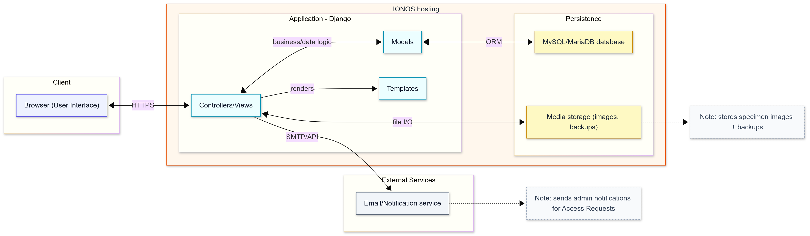
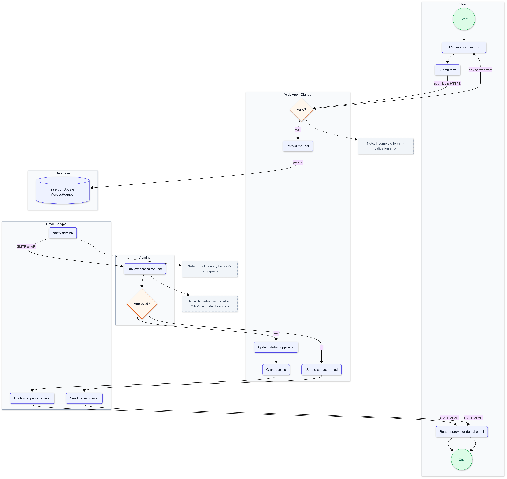
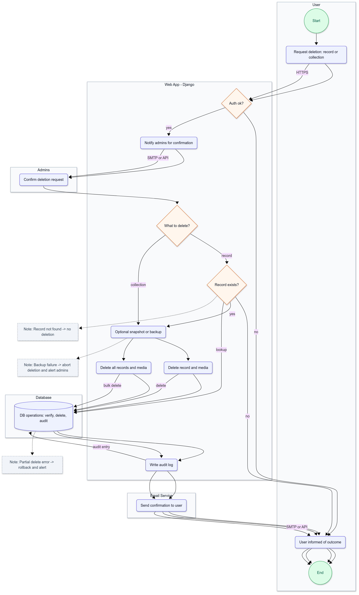
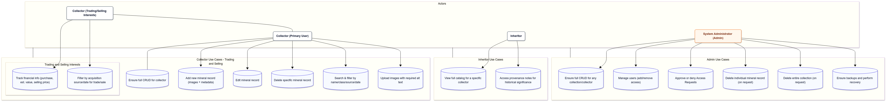

## 1. Document Information

- **Project**: Mineral & Gemstone Collection Catalog
- **Author(s)**: David H. Slack
- **Date Created**: 9/21/2025
- **Last Updated**: 9/21/2025
- **Version**: 0.1 (Draft)

***

## 2. Overview

### **Summary:**

The Mineral & Gemstone Collection Catalog is a web-based application built using Python and Django, offering collectors, hobbyists, and amateur geologists a structured, accessible, and archival-quality method for documenting their mineral specimens. The project is vital because it unifies current collection practices, which often rely on spreadsheets, handwritten logs, and scattered photos that are fragmented, prone to data loss, and inconsistent in terms of metadata and provenance. Furthermore, there is no unified platform that enables the seamless assessment of collections, particularly when these collections are passed down to heirs. By offering a centralized digital catalog with detailed provenance tracking and image design, this system addresses the lack of structured tools while ensuring that inheritors can accurately assess the value, historical significance, and authenticity of the specimens. The catalog will improve usability, searchability, and long-term preservation, making collections easier to manage, share, and pass down through generations, thereby fostering a sense of community among collectors.

### **Problem Statement:**

Collectors lack a unified, reliable platform to manage their mineral and gemstone collections. Current practices often fail to link specimen details with images, resulting in a loss of provenance, inconsistent naming, and difficulties in sharing collections. Accessibility standards are not consistently applied, which limits inclusivity and accessibility. The absence of structured digital tools hampers long-term preservation and value tracking. Furthermore, when collections are passed down to inheritors, there is often no standardized method for assessing the collection or its portions, making it difficult for heirs to understand the value, provenance, and significance of the specimens. Without proper documentation, inheritors may struggle to accurately assess the collection's actual worth or historical importance, which can complicate estate planning, insurance, or donation processes.

### **Goals & Objectives:**

- Provide collectors with a simple but powerful CRUD-based catalog for specimens and images.
- Enforce provenance and metadata standards to ensure data quality and archival reliability.
- Implement WCAG 2.1 AA accessibility standards from the outset.
- Ensure efficient search/filtering capabilities across specimen attributes.
- Deliver a deployable, maintainable solution that can scale to thousands of records.
### **Non-Goals**

- The MVA does not include marketplace or buy/sell integration.
- There will be no native mobile app for iOS/Android in this phase; only mobile responsiveness is available.
- AI-driven image recognition or classification is not included.
- The solution is web-only and does not have an offline desktop client.

***

## 3. Context & Background

### **Business Context:**

This project addresses the current needs of the developer and family members for a cohesive mineral collection database. Secondarily, it is part of the *CIDM6325-70 Electronic Commerce and Web Development* course, with objectives that emphasize practical application of web technologies, database integration, and accessibility-compliant design.

- **Practical Application of Tools:** Displays proficiency in Python, Django, and relational databases such as SQLite, MySQL, and MariaDB.
- **Accessibility and Usability Standards:** Adheres to the W3C WCAG 2.1 AA guidelines to ensure inclusive design.
- **Structured Data Management:** Emphasizes database normalization and the reliability of metadata to support long-term tracking of provenance.
- **Deployability:** Confirms real-world applicability by successfully deploying to a commercial hosting provider and establishing a web presence (e.g., IONOS).

In the longer term, the project has potential strategic value beyond the classroom. Collectors and hobbyist communities often lack purpose-built tools, and a lightweight, extensible cataloging system could evolve into a broader SaaS product for heritage archiving, museum collections, or niche marketplaces, or a companion application to applications like [Mindat.org](https://www.mindat.org).

### **Market/Customer Insights**

#### **Personas & Needs**

- **Hobbyist Collector (Primary User):** Manages collections using spreadsheets or notebooks and requires an intuitive catalog system that links photos to specimen records.
- **Trader/Buyer-Seller (Secondary User):** Needs detailed provenance and financial history, including purchase price, estimated value, and selling price, to validate transactions.
- **Club Member or Family Inheritor (Tertiary User):** Requires an easily readable and accessible record of collections for purposes such as estate planning, education, or club and/or community sharing.
- **System Administrator (Administrative Stakeholder):** Responsible for overseeing account management, backups, and audits. 

#### **Supporting Research**

- Informal reviews of collector forums (e.g., [Mindat.org](https://www.mindat.org) communities, Reddit [r/minerals](https://www.reddit.com/r/Minerals/), [r/MinerlPorn](https://www.reddit.com/r/MineralPorn/) indicate consistent frustrations with spreadsheets and the difficulty of linking images with specimen records.

- Informal review of [Geology365](https://www.geology365.com/) shows it is widely used by collectors and clubs, offering specimen cataloging, metadata entry, image upload, and label generation. The platform supports hobby-level needs such as CSV/Excel imports and QR codes, but reviews note it lacks certain administrative workflows (e.g., access requests, inheritance views, collection deletion, and backup management).

- Similar informal surveys of collector resources highlight [MineralDB / ICM Minéralogie](https://www.minerant.org/software.html) as a free cataloging software that supports mineral properties databases, locality data, and image storage. While it satisfies core hobbyist needs for metadata and photo organization, documentation indicates limitations around advanced administrative workflows (e.g., access request handling, inheritance views, and collection-wide deletion).

- Accessibility audits of similar hobbyist tools reveal missing alt text and poor contrast, limiting inclusivity (World Wide Web Consortium (W3C), 2018).

#### **Competitive/Benchmark References**

- **[Mindat.org](https://www.mindat.org/)** - The world's largest mineral database, but designed for reference, not personal cataloging. Provides taxonomy and mineral class data that can inspire schema standards.
- **[PastPerfect Museum Software](https://museumsoftware.com/)** - A professional archival tool used in museums, strong on provenance but expensive and too complex for hobbyist use.
- **[Excel](https://www.microsoft.com/en-us/microsoft-365/excel)/[Google Sheets](https://www.google.com/sheets/about/)** - The most common hobbyist method; flexible but unstructured, weak in accessibility, and poor for linking images.
- **[CollectiveAccess](https://collectiveaccess.org/)** - An open-source collection management platform; robust but often requires technical hosting skills, making it inaccessible to average hobbyists.
- **[Geology365](https://www.geology365.com/)** - A freemium web-based tool widely used by collectors and clubs, offering cataloging, metadata entry, image upload, label generation, CSV/Excel import, and QR code support. However, it lacks advanced administrative workflows such as access request handling, collection-wide deletion, and backup management.
- **[MineralDB / ICM Minéralogie](https://www.minerant.org/software.html)** - A free cataloging software that supports mineral property databases, locality data, and specimen images. Well-suited for personal collections, but documentation shows limitations in administrative features such as inheritance views, access request handling, and full collection deletion.

Through focusing narrowly on *hobbyist collectors* with a free, lightweight, accessible web app, this project fills a unique gap in the landscape between informal spreadsheets and heavyweight professional software.

***

## 4. Scope

### System Architecture Diagram

##### *MermaidChart. (2025, September 21). System architecture diagram for Mineral & Gemstone Collection Catalog [Diagram]. Generated with MermaidChart. https://www.mermaidchart.com*

### Access Request Workflow Activity Diagram

##### *MermaidChart. (2025, September 21). Access request workflow activity diagram for Mineral & Gemstone Collection Catalog [Diagram]. Generated with MermaidChart. https://www.mermaidchart.com*

### Deletion Workflow Activity Diagram

##### *MermaidChart. (2025, September 21). Deletion workflow activity diagram for Mineral & Gemstone Collection Catalog [Diagram]. Generated with MermaidChart. https://www.mermaidchart.com*

### **In Scope:**

The initial *Minimum Viable Artifact (MVA) (aka: Minimal Viable Product (MVP))* will focus on essential features that can realistically be delivered within a 10 to 12 week graduate project timeline, while also laying a foundation for future enhancements:

- **User Accounts & Authentication**
  - Registration, login, logout, and basic account management.
  - Secure password storage and role-based access (collector vs. admin).

- **CRUD for Mineral Records**
  - Ability to create, view, update, and delete mineral or gemstone entries.
  - Required fields include specimen ID, mineral name, classification, provenance, and acquisition details.

- **Image Upload & Storage**
  - Upload one or more images per specimen record.
  - Mandatory alt text entry for accessibility.
  - Image references will be stored in the database, with files saved in designated directories.

- **Search & Filter Functionality**
  - Search by mineral name, classification, acquisition source, or date.
  - Basic keyword search and dropdown filters will be implemented.

- **Accessibility Baseline**
  - Practices aligned with WCAG 2.1 AA standards (semantic HTML, alt text, consistent labeling).
  - Navigation will be optimized for screen readers and keyboard-only use.

- **Deployment Readiness**
  - Tested deployment to an IONOS-hosted MySQL/MariaDB environment.
  - Basic documentation will be provided in a `/docs/` folder to guide installation and usage.

### **Out of Scope:**

To prevent ambiguity and scope creep, the following items are explicitly excluded from the initial release:

- **Marketplace/Commerce Features**
  - There will be no buy/sell transaction management or payment integration in the Minimum Viable Application (MVA).
  
- **Advanced Analytics & Visualization**
  - Built-in dashboards, charts, or reporting beyond basic search and filter will not be included.
  
- **Mobile Applications**
  - We will not have native Android or iOS apps; only a mobile-responsive web design will be considered for future releases.
  
- **AI/ML Capabilities**
  - Features such as automated image recognition, mineral classification, or predictive valuation will not be part of this release.
  
- **Multi-Tenant or Multi-User Sharing**
  - There will be no shared catalogs across multiple user accounts; each account will maintain its own separate catalog.
  
- **Offline Functionality**
  - There will be no desktop client or offline-first web features.
  
- **Internationalization/Localization**
  - The interface will be in English only; no multilingual or multi-currency support will be available at this stage.

***

## 5. User Stories & Use Cases

### **Use Case Diagram**

##### *Use case diagram for the *Mineral & Gemstone Collection Catalog* web application. Created with MermaidChart on September 22, 2025 (MermaidChart, 2025).*

### **User Stories**

**Collector (Primary User)**

- As a collector, I want to add a new mineral specimen with images and metadata so that I can preserve provenance and avoid losing details over time.
- As a collector, I want to search my catalog by mineral name or acquisition source so that I can quickly locate specific specimens.
- As a collector, I want to edit or delete records so that I can correct mistakes or remove duplicates.
- As a collector, I want to upload multiple images with required alt text so that my catalog is both rich in detail and accessible to others.

**Collector with Trading/Selling Interests (Extended Role)**

- As a collector interested in selling, I want to track purchase price, estimated value, and potential selling price so that I can manage the financial aspects of my collection.
- As a collector interested in trading, I want to filter specimens by acquisition source or date so that I can prepare items for sale, trade, or appraisal.
- As a collector interested in transactions, I want provenance details clearly linked to each record so that I can demonstrate authenticity to potential buyers.

**Family Member / Inheritor (Tertiary User)**

- As an inheritor, I want to view the catalog without needing technical knowledge so that I can understand the scope and value of the collection.
- As an inheritor, I want records to include provenance notes so that I can appreciate the historical or sentimental importance of each item.

**System Administrator (Administrative Stakeholder)**

- As an admin, I want to enforce required fields (e.g., mineral name, alt text) so that data integrity and accessibility are maintained.
- As an admin, I want to ensure backups of records and images so that data is not lost in case of a crash.
- As an admin, I want to be able to review and approve "Access Request" forms, and send notifications to all admins upon form submission.
- As an admin, I want to delete individual mineral records or entire collections upon user request, ensuring that these actions are traceable.

### **Use Cases**

**UC-1: Add a New Mineral Record**  
    Actor: Collector

    Precondition: User is logged in with an active account.
    
    Steps:
    1. Navigate to "Add Specimen" form.
    2. Enter mineral name, class, acquisition details, provenance notes.
    3. Upload one or more images; enter alt text.
    4. Save record.

    Postcondition: A new specimen record is created and displayed in the catalog.

    Edge Case: User omits alt text → System prevents saving until all images have alt text.

**UC-2: Search and Filter Records**
    Actor: Collector (including those trading/selling)
    
    Precondition: User is logged in and has existing specimen records.
    
    Steps:
    1. Enter a keyword (e.g., "Quartz") or select filters (e.g., class = silicate, date = 2023).
    2. System displays matching specimens.
    
    Postcondition: Results are shown in under 2 seconds.
    Edge Case: No results found → System displays "No records found" with option to clear filters.

**UC-3: Admin Access Request Form**
    Actor: System Administrator
    
    Precondition: A user submits an "Access Request" form.
    
    Steps:
    1. Admin receives email notification about the form.
    2. Admin reviews the access request.
    3. Admin approves or denies the request and notifies the user.
    
    Postcondition: User either gains access or is informed of denial.
    Edge Case: Form is incomplete → Admin requests missing information.

**UC-4: Delete Mineral Record (Admin Request)**
    Actor: System Administrator
    
    Precondition: User requests deletion of a specific mineral record.
    
    Steps:
    1. Admin confirms identity and authorization for the deletion request.
    2. Admin deletes the record.
    3. Admin sends confirmation email to the user.

    Postcondition: Mineral record is permanently deleted.
    Edge Case: Record does not exist → System notifies admin of missing record.

**UC-5: Delete Entire Collection (Admin Request)**
    Actor: System Administrator

    Precondition: User requests deletion of their entire collection.
    
    Steps:
    1. Admin confirms identity and authorization for the deletion request.
    2. Admin deletes all associated records for the user.
    3. Admin sends confirmation email to the user.

    Postcondition: All records associated with the user are deleted.
    Edge Case: Collection is empty → System notifies admin of no records to delete.

***

## 6. Functional Requirements

**FR-001: User Account Management**

- The system shall provide secure user registration, login, and logout.
- Passwords must be stored using industry-standard hashing (e.g., PBKDF2).
- **Tied to:** Collector & Admin user stories (*As a collector, I want to register/login...*).
- **Acceptance Criteria:** A new user can register and successfully log in; failed attempts are rejected with error messages.

**FR-002: Role-Based Access Control (RBAC)**

- The system shall distinguish between collectors and administrators, providing appropriate permissions.
- **Tied to:** Admin user story (*As an admin, I want to enforce required fields...*).
- **Acceptance Criteria:** Collectors cannot access admin dashboards; admins can manage user accounts and enforce validation rules.

**FR-003: CRUD for Mineral Records**

- The system shall allow collectors to create, view, update, and delete mineral/gemstone records.
- Required fields: `mineral_name`, `mineral_class`, `acquisition_details`.
- **Tied to:** Collector user stories (*As a collector, I want to add/edit/delete specimens...*).
- **Acceptance Criteria:** A collector can create a specimen with mandatory fields and see it appear in the catalog; edits and deletes update the database correctly.

**FR-004: Image Upload with Alt Text Enforcement**

- The system shall allow one or more images to be attached to each specimen record.
- Each image must include a mandatory **alt text** field.
- **Tied to:** Accessibility stories (*As a collector, I want to upload multiple images with required alt text...*).
- **Acceptance Criteria:** Records cannot be saved unless all uploaded images include alt text.

**FR-005: Search & Filter Functionality**

- The system shall allow keyword search across mineral name, class, acquisition source, and date.
- **Tied to:** Collector & Trader stories (*As a collector, I want to search/filter specimens...*).
- **Acceptance Criteria:** Searches return correct results in under 2 seconds for datasets ≤ 5,000 records; empty searches return "No records found."

**FR-006: Financial Tracking (Optional Field Set)**

- The system shall allow collectors to record optional financial attributes: purchase price, estimated value, selling price.
- **Tied to:** Collector with trading/selling interests stories (*As a collector interested in selling...*).
- **Acceptance Criteria:** If entered, values persist with the record and can be updated; if omitted, the record still saves successfully.

**FR-007: Provenance & Metadata Storage**

- The system shall provide fields for provenance notes and acquisition details (date, method, source).
- **Tied to:** Inheritor & collector stories (*As an inheritor, I want provenance notes...*).
- **Acceptance Criteria:** Notes and acquisition data are displayed in the specimen detail view.

**FR-008: Accessibility Compliance**

- The system shall implement WCAG 2.1 AA-aligned features including semantic HTML, form labels, alt text, and keyboard navigation.
- **Tied to:** Accessibility baseline scope & admin enforcement.
- **Acceptance Criteria:** Pages pass automated WCAG compliance checks; screen reader testing verifies labels/alt text.

**FR-009: Backup and Data Recovery**

- The system shall support periodic backups of both database records and image files.
- **Tied to:** Admin user story (*As an admin, I want to ensure backups...*).
- **Acceptance Criteria:** Admin can restore the database and images to a working state from the latest backup.

**FR-010: Deployment to IONOS Environment**

- The system shall be deployable to an IONOS-hosted MySQL/MariaDB environment.
- **Tied to:** Deployment feasibility success metric.
- **Acceptance Criteria:** The app runs on the target hosting environment with stable CRUD and search functionality.

***

## 7. Non-Functional Requirements

**NFR-001: Performance**

- The system shall return search and filter results within **2 seconds** for datasets up to **5,000 records**.
- **Acceptance Criteria:** Performance benchmarks confirm query responses ≤ 2 seconds on test data of 5,000 records.

**NFR-002: Scalability**

- The system shall support future dataset growth up to **50,000 records** with database indexing and pagination.
- **Acceptance Criteria:** Stress testing with ≥ 50,000 records shows stable operation without system crashes.

**NFR-003: Security**

- The system shall encrypt passwords using secure hashing (PBKDF2 or equivalent).
- The system shall use HTTPS for all communications in production.
- **Acceptance Criteria:** Security audit confirms no plaintext credentials are stored or transmitted.

**NFR-004: Accessibility**

- The system shall comply with **WCAG 2.1 AA** standards (alt text, semantic HTML, keyboard navigation, form labels).
- **Acceptance Criteria:** Automated accessibility scans and manual screen reader tests validate compliance.

**NFR-005: Usability**

- The system shall allow users to enter and retrieve specimen records within **3 clicks** or fewer.
- **Acceptance Criteria:** Usability testing with at least 3 users confirms records can be added and retrieved without major confusion.

**NFR-006: Reliability & Availability**

- The system shall maintain **99% uptime** during testing and deployment.
- Automated backups shall run at least **once every 24 hours**.
- **Acceptance Criteria:** Monitoring reports confirm uptime; backup logs confirm scheduled jobs completed successfully.

**NFR-007: Maintainability**

- The system shall be modular, with separate layers for models, views, templates, and static files in Django.
- Documentation shall be maintained in a `/docs/` folder within the GitHub repository.
- **Acceptance Criteria:** Code review confirms modularity and inline comments; documentation includes setup and deployment steps.

**NFR-008: Portability**

- The system shall run on both **local development environments (SQLite)** and **production environments (MySQL/MariaDB on IONOS)** without major code changes.
- **Acceptance Criteria:** Successful migrations and CRUD operations run on both environments.

**NFR-009: Data Integrity**

- The system shall enforce validation rules (e.g., required fields for mineral name, class, acquisition details, and alt text for images).
- **Acceptance Criteria:** Attempts to save incomplete or invalid records are blocked with error messages.

**NFR-010: Compliance**

- The system shall comply with relevant academic and project guidelines for CIDM6325-70.
- **Acceptance Criteria:** Final submission passes course rubric checks on functionality, accessibility, and documentation.

***

## 8. Dependencies

### Internal System Dependencies

- **Django Framework** - Provides the MVC structure (models, views, templates) for implementing CRUD and authentication.
- **Django REST Framework (optional)** - Enables future API development and modular extension for mobile or third-party integration.
- **Database Engines** - SQLite for local development and MySQL/MariaDB for production deployment on IONOS.
- **Static/Media File Handling** - Django's built-in file storage system for specimen images, requiring proper configuration for IONOS hosting.

### External APIs / Third-Party Services

- **IONOS Hosting Platform** - Provides web server, database hosting, and storage for deployment.
- **Python Package Index (PyPI)** - Source for external Django packages (e.g., Pillow for image handling).
- **WCAG 2.1 Guidelines (W3C)** - Serves as the external standard for accessibility compliance.
- **Version Control (GitHub)** - Required for source code management, collaboration, and documentation tracking.

### Cross-Team Deliverables

- **Course Deliverables** - PRD, design documentation, and codebase submitted for CIDM6325-70 evaluation.
- **Documentation** - Setup instructions, `/docs/` folder with schema diagrams, accessibility audit reports.
- **Peer Review Feedback** - Classmates or instructors providing iterative critiques during development.
- **Testing Reports** - Usability, accessibility, and performance test results for verification against requirements.

***

## 9. Risks & Assumptions

### Risks

- **Data Loss During Upload or Server Failure**
  - *Mitigation:* Automated daily backups and transaction-safe database operations.
- **Accessibility Gaps**
  - *Mitigation:* Enforce required alt text on image uploads, conduct WCAG compliance audits.
- **Performance Bottlenecks with Large Datasets**
  - *Mitigation:* Implement database indexing, caching, and pagination.
- **Deployment Issues with IONOS Hosting**
  - *Mitigation:* Early testing in staging environments; fallback to SQLite for local demonstrations.
- **Scope Creep**
  - *Mitigation:* Clearly define in-scope vs. out-of-scope features; track changes against MVA goals.

### Assumptions

- Users will have stable internet access and modern browsers (Chrome, Firefox, Edge, Safari).
- Collectors are motivated to provide complete metadata (name, class, acquisition details, provenance).
- IONOS hosting supports Django with MySQL/MariaDB integration without major compatibility issues.
- Project timeline is limited to **10-12 weeks**, requiring focus on MVA deliverables.
- Accessibility standards (WCAG 2.1 AA) are non-negotiable for evaluation and inclusivity.

***

## 10. Acceptance Criteria

- **FR-001 (User Account Management):** Passes when a new user can register, log in, and log out securely, with passwords hashed and no plaintext storage.
- **FR-002 (Role-Based Access Control):** Passes when collectors cannot access admin functions, and admins can enforce data validation rules.
- **FR-003 (CRUD for Mineral Records):** Passes when a collector can add, edit, and delete specimens, with mandatory fields enforced.
- **FR-004 (Image Upload with Alt Text):** Passes when a specimen cannot be saved without alt text for all images.
- **FR-005 (Search & Filter):** Passes when results are returned within **2 seconds** for ≤ 5,000 records, and a "No records found" message displays if empty.
- **FR-006 (Financial Tracking):** Passes when optional financial fields (purchase price, estimated value, selling price) persist with a record if provided.
- **FR-007 (Provenance & Metadata):** Passes when provenance notes and acquisition details appear correctly in the specimen detail view.
- **FR-008 (Accessibility Compliance):** Passes when automated WCAG 2.1 AA scans and manual screen reader tests confirm compliance.
- **FR-009 (Backup & Recovery):** Passes when the admin can restore the catalog from a backup with \<24 hours of data loss.
- **FR-010 (Deployment to IONOS):** Passes when the system is successfully deployed to IONOS, accessible via the web, and fully functional.

***

## 11. Success Metrics

- **Usability**
  - ≥ 80% of testers can add and retrieve records within **3 clicks** during usability testing.
- **Data Quality**
  - ≥ 95% of specimen records contain complete metadata (mineral name, class, acquisition details).
- **Accessibility Compliance**
  - 100% of images include alt text.
  - All pages pass WCAG 2.1 AA automated scans.
- **Performance**
  - Average query response time ≤ 2 seconds for datasets ≤ 5,000 records.
- **Reliability**
  - ≥ 99% uptime during testing/deployment.
  - Automated daily backups successfully logged with \<1% failure rate.
- **Adoption / Engagement (Future Iterations)**
  - ≥ 70% of test users express intent to continue using the catalog after pilot testing.
  - Positive qualitative feedback from peer reviews in class project presentations.

***

## 12. Rollout & Release Plan

### Phasing

- **MVP (Minimum Viable Product):**
  - User authentication (registration, login, logout).
  - CRUD for mineral records.
  - Image upload with required alt text.
  - Search and filter by name, class, acquisition source, or date.
  - Accessibility baseline (WCAG 2.1 AA compliance).

- **Future Iterations (Beyond MVP):**
  - Deployment to IONOS with MySQL/MariaDB.
  - Advanced filters (hardness, streak, luster, crystal system).
  - Multi-user sharing of catalogs (clubs, groups).
  - Marketplace extensions for trading/selling.
  - Mobile-first responsive UI refinements.
  - AI/ML-assisted mineral identification (long-term).

### Release Channels

- **Beta Release:** Local SQLite environment for classroom testing and peer review.
- **Staged Rollout:** Adoption for MySQL or MariaDb with limited deployment to IONOS with test accounts for controlled evaluation.
- **General Availability:** Full class demonstration on IONOS hosted application site.

### Training / Documentation Needs

- **Internal Documentation:** Setup guide, schema diagrams, system architecture docs stored in `/docs/`.
- **Support Guides:** Quick-start guide for collectors on adding specimens, uploading images, and using search. Preferably online.
- **User Education:** Accessibility usage notes (e.g., importance of alt text, recommended metadata practices). Preferably online.

***

## 13. Open Questions

- Should images be stored directly in the database (BLOB) or as file references with paths in the database?
- Will IONOS hosting impose any file size limits or restrictions on media storage?
- Should financial details (purchase price, estimated value, selling price) be **optional** for all users or require explicit enabling?
- How should multi-user functionality (catalog sharing, clubs) be designed for scalability in later iterations?
- Should the project adopt Django REST Framework (DRF) in MVP for future-proofing, or defer until later?
- Is there a need for multilingual support (English-only assumed for MVP)?
- Should the application provide online help and notes for authenticated users only?

***

## 14. References

- Django Software Foundation. (n.d.). *Django: The web framework for perfectionists with deadlines*. Retrieved September 13, 2025, from <https://www.djangoproject.com/>
- World Wide Web Consortium (W3C). (2018). *Web Content Accessibility Guidelines (WCAG) 2.1*. Retrieved September 13, 2025, from <https://www.w3.org/TR/WCAG21/>
- Internal project proposal memo: *CIDM6325-70: Electronic Commerce and Web Development Project Pitch Memo - Mineral & Gemstone Collection Catalog*, September 13, 2025.
- Course Guidelines & Rubric: CIDM6325-70 Electronic Commerce and Web Development (Fall 2025).
- OpenAI. (2025, September 21-22). ChatGPT assistance with Product Requirements Document (PRD) for Mineral & Gemstone Collection Catalog [Large language model interaction]. OpenAI. https://chat.openai.com/
- MermaidChart. (2025, September 22). Use case diagram for Mineral & Gemstone Collection Catalog [Diagram]. Generated with MermaidChart. Retrieved from https://mermaidchart.com
